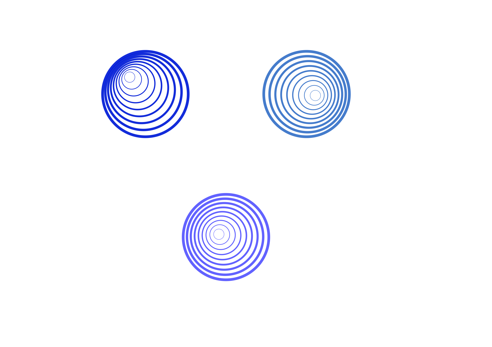
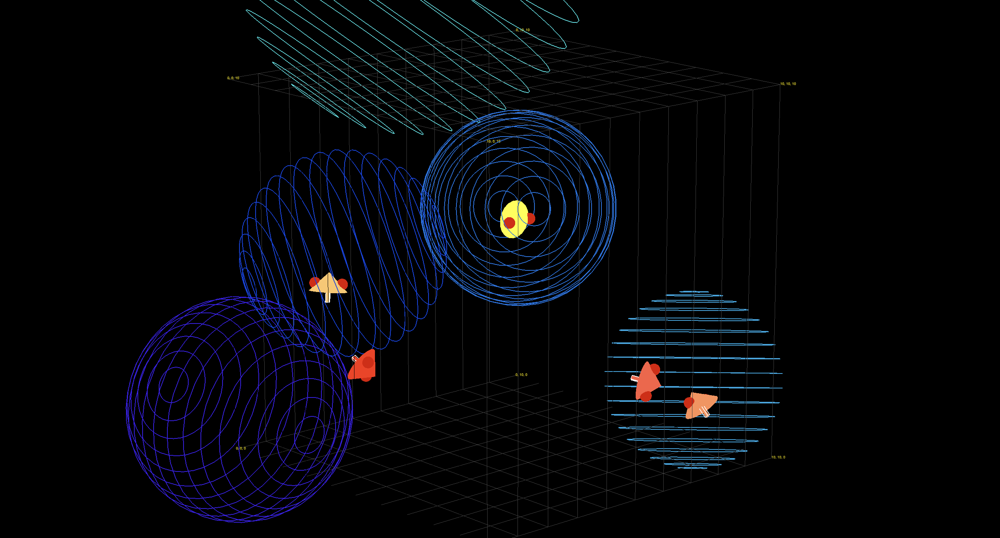
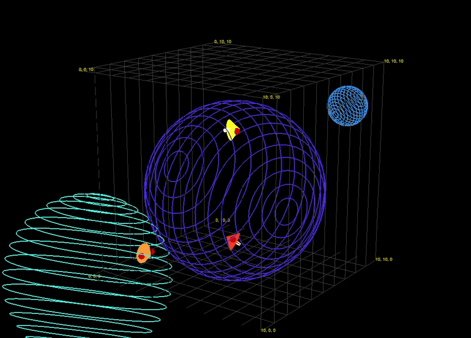
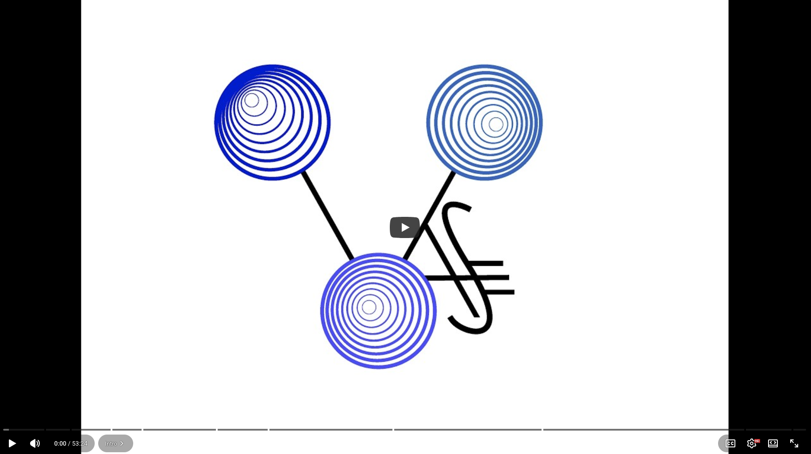

	

VASE (Virtual Acoustic Spatial Entities) is a Max-based telematic performance system which allows for for unique perspectives in a shared virtual space. The system is designed to slot into typical telematic performance tech configurations as a audio processing layer that occurs before sending individualized perspectives back to players.

VASE places performers alongside dynamic virtual acoustic agents. These "space-agents" populate the encompassing space, allowing for unique compositional approaches to electroacoustic performance. Composers working with the system can define custom layouts and playback timed events for the position and orientation of players and space-agents, or trigger temporal jumps in the timeline itself.

### Reactive Acoustic Zones
VASE's space-agents are able to listen to all incoming audio and react based on an established "behavioural genome" - a parametric weighting of particular spectral and chromatic features that a particular space-agent should "care" about. Agents are able to move toward and away from players based on their established preferences, and pick up or "adopt" players to move them around the space.

### System Walkthrough
A system walkthrough with feature examples can be found here:

Installation and server hosting instructions can be found in the "host" folder README.md:
[Here](https://github.com/roryhoy/VASE/blob/main/host/README.md)

### Dependencies
- VASE requires **Max 9** or above: [https://cycling74.com/products/max-9](https://cycling74.com/products/max-9) 

- VASE uses ambisonic functionality from **IRCAM's Spat 5**. Please install Spat from [forum.ircam](https://forum.ircam.fr/projects/detail/spat/) (account required). *Spatialisateur is an IRCAM registered trademark. The design of Spat and the reverberation module are protected under several French and international patents ([FR] 92 02528; [US] 5,491,754, [FR] 95 10111; [US] 5,812,674).*

- VASE uses routing objects from the **CNMAT Externals** package. This can be downloaded from the package manager inside of Max. *OSC-route by Matt Wright, Michael Zbyszynski. Copyright (c) 1999,2000-08,13 Regents of the University of California.  All rights reserved.*

####More Info:
This project is developed and distributed in partial fulfillment of the requirements for the degree of Doctor of Philosophy in Digital Media, York University, Toronto, Canada. 

Accompanying dissertation materials will be linked once made available online.